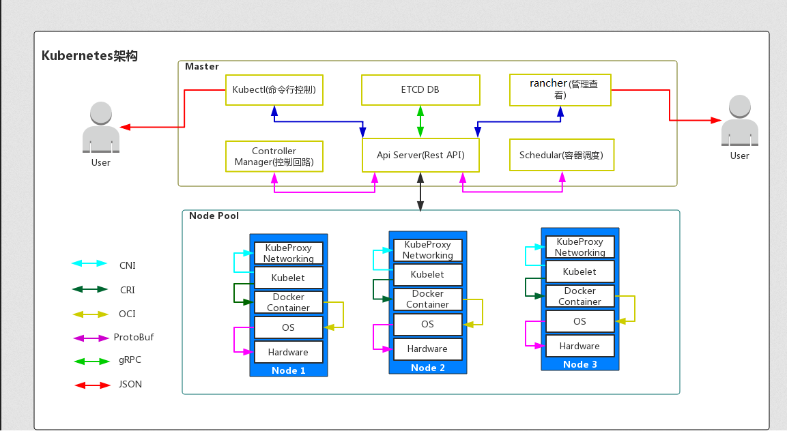

一、传统的运维方式

在了解Kubernetes之前，我们有必要先简单了解一下传统的运维模式。在传统的项目架构中(单体or微服务)，我们一般将项目打包为war或fatJar的方式进行部署。

在部署时，需要人工创建相应的服务器及资源，并搭建项目运行的依赖环境，预估服务需要占用的内存与CPU，同事还要考虑到高可用的部署环境，在不同配置的服务器上部署相应的服务。当服务意外崩溃或者服务器意外宕机时，需要人工处理。总结一下传统部署的不足如下:

    依赖服务器环境，需要各服务器资源统一。
    无法充分利用服务器等资源，使用率一般仅能达到70%。
    无法或很难做到容灾恢复。
    需要人工进行服务扩容，修改服务配置。
    服务资源散乱(域名，服务器，负载，数据库)，无法做集中管理。
    时间消耗较多，增加运维成本。
    需要借助第三方工具进行资源监控，较为麻烦。
    需要对开发、测试、生产环境进行区别管理。

要想解决以上的问题是相对比较麻烦的，特别是现在的项目多为微服务项目，少则几十，多则上百，极大的增加了运维的难度和成本。

## 一、Kubernetes是什么？

> 因kubernetes名字过长，一般 简称为k8s，因为k与s之间有8个字母，故而称之。

官方文档中描述为:

    Kubernetes一个用于容器集群的自动化部署、扩容以及运维的开源平台。通过Kubernetes,你可以快速有效地响应用户需求;快速而有预期地部署你的应用;极速地扩展你的应用;无缝对接新应用功能;节省资源，优化硬件资源的使用。为容器编排管理提供了完整的开源方案。

介绍一下其中提到的几个 词:

    容器 
        我们现在常说的容器一般是指Docker 容器，通过容器 隔离的特性和宿主机进行解耦， 使我们的服务 不需要依赖于 宿主机而 运行， 与宿主机互不 影响，Docker容器十分轻量。而kubernetes则负责管理服务中所有的Docker容器，创建、运行、重启与删除容器。
    快速响应
        个人理解为 两个方面。一、新增或者修改需求时，可以快速进行部署测试(CICD)；二、kubernetes可以根据不同条件进行动态扩缩容， 举个栗子，用户访问量突然由1000人上升到100000人时，现有的服务已经无法支撑，kubernetes会自动将用户服务模块增加更多实例以保证当前的系统访问 量。
    扩展
        在快速响应的特点中已经有所提及，这里再补充一 点: Kubernetes 内部有完善的注册发现机制， 当  某个服务的实例增加时，kubernetes 会自动将其加入服务列表中，免除在传统运维中需要人工维护服务列表的问题。
    对接新应用
        kubernetes是一个通用的容器编排框架，支持不同类型的语言， 或者是语言无关的，新增加的应用都会以一个新的对象进行接入。
    硬件资源
        这一点我  觉得是kubernetess很基本但是非常重要的一个优点了，kubernetes在部署应用时会 自动检查各个服务器的cpu与内存使用 量，同时会根据服务申请的cpu与内存资源，将服务部署到最合适的服务器。(其实这就是容器调度的核心功能了)
        
## 二、Kubernetes解决了什么问题？

下面以几个case进行阐述，便于理解。
服务器环境

kubernetes是使用Docker进行容器管理的，所以天生具备Docker的所有特性，只需要使用相应环境的Docker镜像就可以运行服务 ，还需要关心宿主机是redhat、centos还是ubuntu，只要在宿主机上安装Docker环境即可，相比传统运维，减少了各种依赖环境的冲突，降低运维成本，也方便整体服务的迁移。
服务器资源管理

对于kubernetes 来说，是不关心 有几台服务器的，每个服务器都是一个资源对象(Node)，kubernetes关心的是这个Node上有多少可用的cpu和内存。例如现在有两台服务器

    server01 (4c16g), 已用(2c7.5G)
    server02 (4c16g), 已用(3c13G)

现在有一个服务ServiceA需要部署，ServiceA申明自己运行需要至少3G内存，这时kubernetes会根据调度策略将其部署到server01上，很明显server01的资源是更加充足的。实际上kubernetes的调度策略要 复杂的多，kubernetes会监控整体 服务器资源的状态进行调度，而 以前的运维方式只能由人工判断资源使用。这里只做简单示例。

## 三、服务容灾恢复

说简单 点，就是服务挂了之后，能够自动恢复。例如现在有一个ServiceA，运行在server01上，kubernetes会通过内部的kubelet组件监控ServiceA服务进程的状态，一旦发现进程丢失(服务本身挂掉或者整个server01的服务器 挂掉)，就会尝试换一台资源充足的服务器 重新部署ServiceA并启动，这样就可以 确保我们的服务一直是可用状态，而不 需要人工维护。
## 四、硬件资源利用

前面已经说过，kubernetes会根据节点(Node)的CPU与内存资源的可用量对 服务进行部署调度，在调度策略中，可以配置不同的调度策略。 例如现在有两台服务器：

    server01 (4c16g), 已用(3c7.5G)
    server02 (4c16g), 已用(1c13G)

需要部署两个服务

    serviceA-Java, 申请2G内存，0. 5CPU单位
    ServiceB-Nginx, 申请200M内存,申请1CPU单位

 这里kubernetes如果讲道理的话，会将ServiceA-Java部署到server01，将serviceB-Nginx部署到server02。这里server01的内存和server02的CPU资源都 得到了充分的利用。经过个人实践，相比之前  的部署方式，kubernetes节省了很多资源，资源利用是非常高效的。

## 五、kubernetes 特点
网络模型

kubernetes采用了三层网络模型，分为PodIP,ClusterIP,NodeIP。用简单的话来说，kubernetes在内部使用自己的网络进行通讯，这样做一个最直接的好处是我们不用再担心端口冲突的问题。

举个栗子:  我们在server01上部署两个一样的服务serviceA-1,serviceA-2,两个服务的 端口都是8080，这个时候有一个服务是无法启动的，因为端口被占用了，而在kubernetes中，两个服务在不同的Docker容器中,每个Docker容器 都有自己的IP,这时就不 会出现端口占用的问题了。

为什么要有三层网络有三个IP呢？其实每个IP的作用是不一样的：

    NodeIP
        NodeIP是最好理解的，就是每个服务器的IP。例如server01的IP是192.168.1.2，有一个服务实例的IP申明类型为NodeIP，  端口申明为30222,那么我们就可以通过192.168.1.2:30222访问到这个服务实例。
    PodIP
        PodIP的作用可以简单理解为每个服务自己teyoudeIP,就像上面说的可以解决端口冲突的问题，同时也是每个服务的唯一标识。PodIP是无法通过外网访问的，只能在服务内部进行访问。
    ClusterIP(可以 按照下面访问的进行理解，但实际有所区别)
        中文叫集群IP，对集群了解的同学应该很容易理解。 集群IP可以简单理解为是对同一个服务的多个实例(每个实例有自己的PodIP)组成的集群的入口IP，换句话说，是对多个实例的负载IP。举个栗子：

有三个实例:

    serviceA-1 172.22.1.2
    serviceA-2 172.22.1.3
    serviceA-3 172.22.1.4

有一个ClusterIP 172.23.2.23指向了serviceA服务，那么我们访问172.23.2.23  则会负载转向到172.22.1.2、172.22.1.3、172.22.1.4中的其中一个服务
## 对象

在kubernetes中，万物皆对象。路由(Ingress)、服务(Service)、部署(Deployment)、存储(Storage/PV/PVC)、容器(Pod)、 角色(Role)、账户(Accoutn)、配置(ConfigMap) 等等。通过管理这些对象来管理整个kubernetes集群。

    注意：此处说的服务(Service),不同于上文提到的服务(开发的项 目模块)

## 声名式管理

kubernetes采用声名式进行资源管理，也就是从结果来看问题。举个栗子，  现在需要部署十个ServiceA

 面向过程: 部署ServiceA-01,再部署ServiceA02…..ServiceA-10，强调的是过程，用代码来表示的话就是while(serviceA.count < 10) {serviceA.count++}

 面向结果(声明式):不管是同时部署还是挨个部署，总之要部署十个ServiceA服务。用代码来表示的话就是kubernetes.addServiceA(10),不用管内部的细节怎么处理，只要最终的结果。

Kubernetes常用相关概念
部署 - Deployment

类似  于Docker中的镜像Image，也就是容器(Pods)实例的模板，容器实例是根据Deploy创建出来的。在Deployment对象中会写明容器的镜像，容器的版本，容器要部署的数量等信息。
容器组 - Pods

Pods是Kubernetes中的最小管理单元，Pods和Docker中的容器可以理解为包含关系，在Pods中可以包含有多个Docker容器，例如有ServiceA和ServiceB,ServiceA 高度依赖ServiceB(需要共享主机的相同文件), 这时就可以将ServiceA 与ServiceB放在同一个Pods中，当做一个整体来管理。如果分开部署当然也可以，不过会小号额外的资源或者产生其他不必要的麻烦。
服务 - Service

Service是一个对象，这个对象有自己的IP， 也就是ClusterIP,可以理解为就是下层服务的负载均衡。
路由 - Ingress

无论是容器组还是Service，外网 都是无法直接访问的，Ingress就可以通过一个负载IP与Kubernetes集群内部进行通讯，一般 会和Service对象进行配合使用。
配置项 - ConfigMap

简单理解为一个管理配置的对象，可以将项目的配置写入到ConfgiMap中，项目中的配置使用相应的变量名就可以读取相应的变量值。

还有很多其它概念，这是就不一一介绍了，可以 参考[Kubernetes中文社区](https://kubernetes.io/zh/docs/concepts/overview/what-is-kubernetes/)

## Kubernetes结构图

Kubernetes由Master节点和Worker节点 组成。master节点是Kubernetes的大脑，而woker节点则是kubernetes中实际运行服务的 劳动者。

Master主要由ETCD/Controller Manager/Api Server/Schedular能成，

    ETCD
        主要负责存储各个woker节点的状态和其它相关数据， 可以理解为kubernetes的数据库。
    Controller Manager
        负责维护集群的状态，比如故障检测、自动扩展、滚动更新等
    Scheduler
        负责资源的调度，按照预定的调度策略将Pod调度到相应的机器上

Worker主要由kubelet和kube-proxy组成，一般还会安装kube-dns组件。

    kubelet
        负责维护容器的生命周期，同时也负责Volume（CVI）和网络（CNI）的管理；
    kube-proxy
        负责为Service提供cluster内部的服务发现和负载均衡；
    kube-dns
        负责为整个集群提供DNS服务，通过Service名称访问相应的服务

