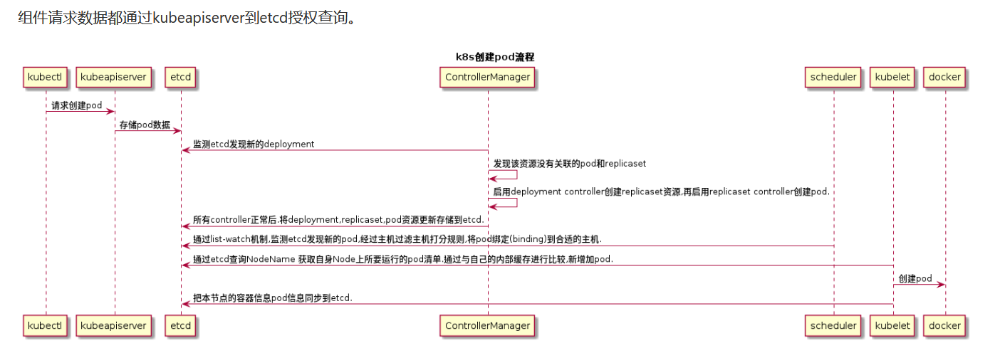

组件请求数据都通过kubeapiserver到etcd授权查询。
```plantuml
@startuml
title k8s创建pod流程


kubectl -> kubeapiserver : 请求创建pod

kubeapiserver -> etcd : 存储pod数据

ControllerManager -> etcd: 监测etcd发现新的deployment
ControllerManager -> ControllerManager : 发现该资源没有关联的pod和replicaset
ControllerManager -> ControllerManager : 启用deployment controller创建replicaset资源,再启用replicaset controller创建pod.
ControllerManager -> etcd : 所有controller正常后.将deployment,replicaset,pod资源更新存储到etcd.

scheduler -> etcd : 通过list-watch机制,监测etcd发现新的pod,经过主机过滤主机打分规则,将pod绑定(binding)到合适的主机.

kubelet -> etcd : 通过etcd查询NodeName 获取自身Node上所要运行的pod清单.通过与自己的内部缓存进行比较,新增加pod.
kubelet -> docker : 创建pod
kubelet -> etcd : 把本节点的容器信息pod信息同步到etcd.

@enduml
```

