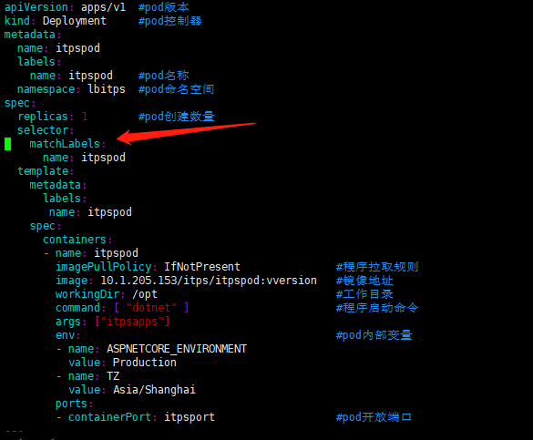

> 生产安装是由kubeadm方式安装，因此集群故障一般较低发生

# 集群故障

```
[root@m1 tmp]# kubectl get node
NAME    STATUS   ROLES    AGE   VERSION
m1      Ready    master   18d   v1.16.9
m2      NotReady    master   18d   v1.16.9
m3      Ready    master   18d   v1.16.9
node1   Ready    <none>   18d   v1.16.9
node2   NotReady    <none>   17d   v1.16.9
node3   Ready    <none>   17d   v1.16.9
```

**1. master节点故障**

检查docker是否启动

> systemctl status docker


> 解决方式: systemctl restart docker || 失败则分析报错信息

检查etcd是否正常
> kubectl get csr

> 解决方式: 找对对应的etcd宿主机，重启etcd（docker start \`docker ps -qa\`） || 如果失败请分析报错日志

检查flannel网络是否正常

> ip add |grep flannel 

> 解决方式: 请查看docker是否正常启动

检查本地haproxy代理是否正常

>  ping \`cat ~/.kube/config | grep server | awk -F "/" '{print $3}' | cut -d : -f 1\`

> 解决方式: 请查看docker容器haproxy是否正常启动

检查时间是否同步
> 查看时间命令 date 

> 解决方法：
> 1. 同步时间 yum install -y ntp && systemctl restart ntpd &&  systemctl enable ntpd 

> 2. 配置时区： timedatectl set-timezone 'Asia/Shanghai'

检查证书是否是否一致
> kubeadm reset

> 解决方式:  重新加入集群


**2. node节点故障**

检查kubelet服务是否正常

> netstat -lnp | grep kubelet

> 解决方法：一般是由于flannel网络故障以及证书不一致导致。

按照master故障检查一遍

**3. 重要组件无法启动**

> 后期添加，还真没遇到过

# pod故障
# 1. yaml文件格式错误

kubectl apply -f test.yaml
出现报错！
分析：提示(Deployment.spec.selector）在这个层级下的name字段错误


查看后发现当ReplicationController控制器换成Deployment后需要在name字段添加层级字段matchLabels:



# 2. pod创建故障

## 一般创建pod后状态分别为

> Pending 创建pod的请求已经被k8s接受，但是容器并没有启动成功，可能处在：写数据到etcd，调度，pull镜像，启动容器这四个阶段中的任何一个阶段，pending伴随的事件通常会有：ADDED, Modified这两个事件的产生。

> Running pod已经绑定到node节点，并且所有的容器已经启动成功，或者至少有一个容器在运行，或者在重启中。

> Succeeded pod中的所有的容器已经正常的自行退出，并且k8s永远不会自动重启这些容器，一般会是在部署job的时候会出现。

> Failed pod中的所有容器已经终止，并且至少有一个容器已经终止于失败（退出非零退出代码或被系统停止）。

> ERROR 常见于pod内部程序启动失败，查看pod日志分析

> Terminating pod正在等待清除，常见于node节点失联，发出删除任务后无法与node节点连接导致没有收到已删除消息回调。

> Unknown 由于某种原因，无法获得pod的状态，通常是由于与pod的主机通信错误。

> ImagePullBackOff： 正在重试拉取镜像，确认网络以及镜像权限是否正确

更多纤细参考 https://www.bookstack.cn/read/kubernetes-practice-guide/troubleshooting-problems-pod-keep-pending.md


# 异常现象

# 1. pod拉取镜像失败

一般为这2种状态

ImagePullBackOff &&  ImageInspectError 

解决方法:

> docker pull (images-name) 确认镜像可以正常下载

> cat /root/.docker/config.json | base64 -w 0  获取下载权限秘钥并转码

创建yaml文件

```
apiVersion: v1
kind: Secret
metadata:
  name: registry-pull-secret
data:
  .dockerconfigjson: (cat /root/.docker/config.json | base64 -w 0 获取的秘钥值)
type: kubernetes.io/dockerconfigjson
```
kubectl apply -f (name-yaml文件)

# 2. 一直处于状态

> Evicted 出现该现象一般是由于本node资源不足出现驱赶至别的node节点，当出现驱赶失败会导致创建大量Evicted状态的pod，进一步影响性能。

解决方法:

查询驱赶原因

> kubectl describe pod (pod-name) -n (namespace)

解决后删除改状态pod

> kubectl delete pod \`kubectl get pod -n (namespace) | grep Evicted | awk '{print $1}'\` -n  (namespace)

# 3. pod无法上网

解决方法:

排查是否为本地网络故障

查看系统组件pod是否正常


如果故障请使用命令查看详细错误

kubectl describe pod (pod-name) -n (namespace)

# 4. server-api出现CreateContainerError状态

一般改情况属于网络异常断开或者有重启服务的情况发生

解决方法:
找到改api服务的对应docker容器，找到失效的api容器，删除即可恢复，原因是k8s误认为改api为正常使用的api，导致服务器状态为CreateContainerError。
kubectl get pod -n kube-system -o wide
