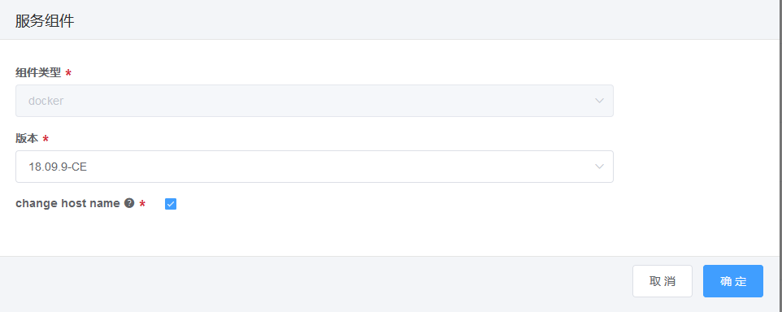
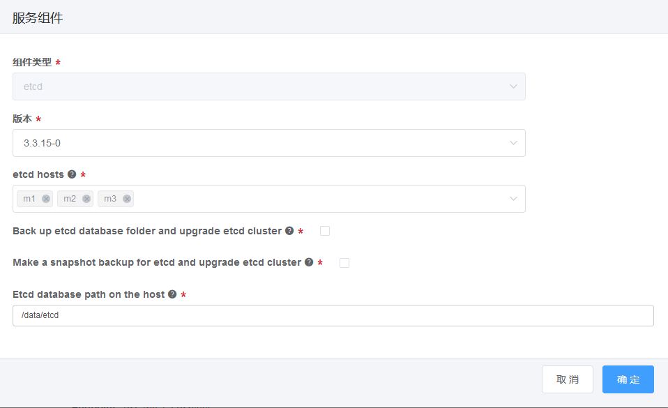
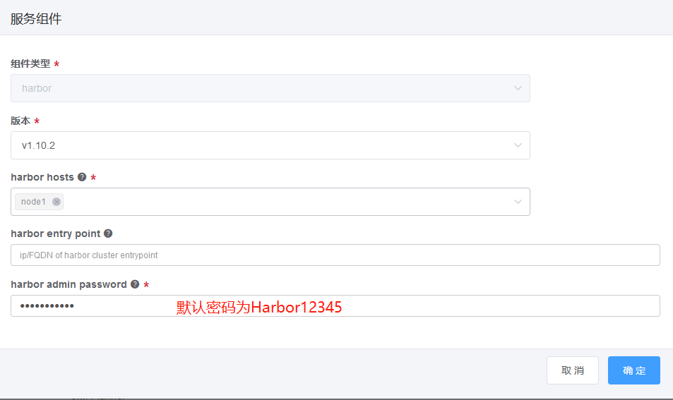
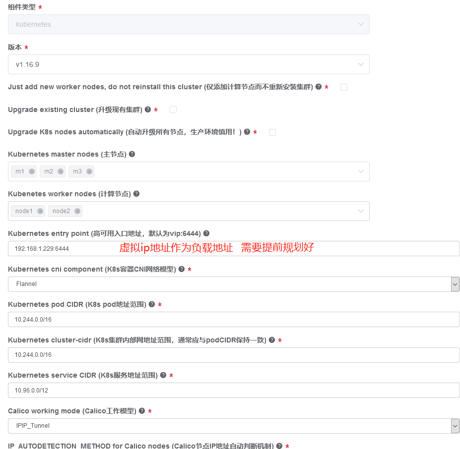

# breeze开源第三方部署
1. 项目地址 https://github.com/wise2c-devops/breeze

2. 离线百度云地址k8s1.16.9

> 链接：https://pan.baidu.com/s/1t8mnSl8Dsj0xPA8_6bVLSQ 

> 提取码：gvli 

# k8s部署服务器生产最低需求
部署机：1台  4核8g 500G硬盘
master节点：3台 8核8g 500G硬盘
node节点：1台 8核16g 500G硬盘

测试服务器IP地址

| 角色        | ip地址        |
|:----------- |:--------------|
| 部署机      | 192.168.1.230 |
| master1     | 192.168.1.231 | 
| master2     | 192.168.1.231 |  
| master2     | 192.168.1.231 | 
| node1       | 192.168.1.231 |
| node2       | 192.168.1.231 |

# 环境需求
## 一、准备部署主机
1. 以标准 Minimal 方式安装 CentOS 7.6 (1810) x64 之后(7.4 和 7.5 也支持)，
登录 shell 环境，
执行以下命令开放 防火墙： 

> setenforce 0 

> sed --follow-symlinks -i "s/SELINUX=enforcing/SELINUX=disabled/g" /etc/selinux/config 

> firewall-cmd --set-default-zone=trusted 

> firewall-cmd --complete-reload 
 
2. 安装 docker-compose 命令 

> curl -L https://github.com/docker/compose/releases/download/1.21.2/docker-compose-$(uname -s)-$(uname -m) -o /usr/local/bin/docker-compose 
> chmod +x /usr/local/bin/docker-compose 

> 安装时间较长请使用已经下载好的离线文件（百度云离线包已存在该文件）
 
3. 安装 docker 

> yum install docker -y 

> systemctl enable docker && systemctl start docker 
 
4. 建立部署主机到其它所有服务器的 ssh 免密登录途径 a) 生成秘钥，执行： 

> ssh-keygen 
 
5. 针对目标服务器做 ssh 免密登录，依次执行：

> ssh-copy-id 所有主机IP
 
## 二、获取针对 K8S 某个具体版本的 Breeze 资源文件并启动部署工具，此次实验针对已测试稳定发布的K8S v1.16.9 

> wget https://github.com/wise2c-devops/breeze/blob/v1.16.9/docker-compose-centos.yml

> mv docker-compose-centos.yml /usr/bin/docker-compose.yml 

> docker-compose up -d 

## 其他centos7.6主机请最小化安装即可
1. lvm划分磁盘

> /boot 200M

> /     剩余所有

# 三、访问http://192.168.1.230:88 部署集群

## 创建主机

## 创建docker

## 创建etcd

## 创建harbor

## 创建haproxy

## 创建kubernetes
